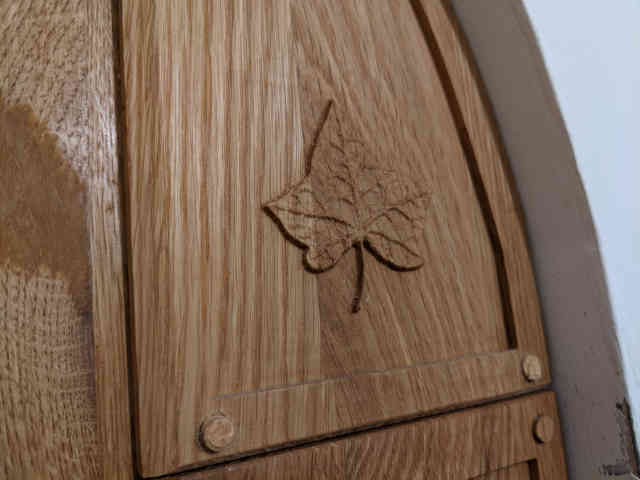
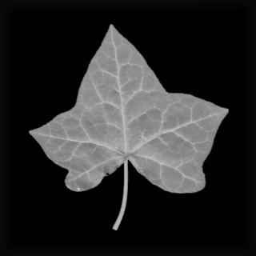

# image2cnc
Python program to generate g-code for openbuilds/workbee CNC 3-axis mill from a jpeg (2.5D CAD).

I wrote this to carve images into wood, like this:

From files like this:

The user interface of the software is not very good, you have to modify the python code directly. Also, beware because I used python 2.7 and I have tried to update it to python 3, but I have not carved anything with the python 3 output yet. Be really careful.

The software takes each line of the image (scanning X, with constant Y), starting from the bottom (X0Y0 = bottom left of the image). Each row (constant Y) runs from from X0 to Xend. The Z height comes from the intensity (RGB images are turned to greyscale). Then the next row is cut (next Y). The program cuts both directions (conventional and climb).

The settings are:
* px2mm - set the scale of how big each pixel should be in mm
* decimation - for the rough cuts you can skip Y-rows, which can make things faster
* finalDecimation - you can skip rows on the final cut too (probably better to prepare the image a different size though)
* whiteCut - the depth (mm) for white pixels (greyscale 255)
* blackCut - the depth (mm) for black pixels (greyscale 0)
* passCut - the maximum depth of cut per pass, the whole image will be cut to the passCut depth, then it will be cut to 2*passCut, etc. This prevents the tool from cutting too much in one go
* blurRadius - I blur some images to help prevent sharp transitions
* toolRadius - so it won't cut unless all the pixels covered by the tool are deep enough
* tool - 'ball' or 'flat', used to search surrounding pixels so additional material isn't removed (with toolRadius)
* safeHeight - for travel moves
* feedRate - for cutting along X direction
* plungeRate - for Z travel at the start of each row, but not checked throughout the cutting

The values I used are in the file, though I used a 2mm ball cutter and specified toolRadius as 1.25mm as this gave the effect I wanted. Take care if you make significant changes as these have not been tested.  

To use the software:

* Prepare your image. Size is important. The software will convert the image to grayscale, but I prefer to do this in the image editor (GIMP, but any will do).
* Rename your image to **img.jpg** (or change the python code)
* At the command line run **python image2cnc_va.py**
* The outputs is **img.nc**
* View the resulting g-code on a g-code viewer to make sure it is what you expect (try http://jherrm.com/gcode-viewer, and drag-drop the img.nc file, see https://github.com/s7711/image2cnc/blob/main/images/ivy_nc.jpg)
* Mount your material on the CNC machine
* Set your work co-ordinates on the bottom left corner. I had Z0 at the top of my material and had the program cut down from Z0. Maybe practice first above the material, just to be safe.
* Run the g-code

To make the leaf in the image, the wood panel was designed using Fusion 360. A square, proud block was left for the carving. Then I carved the leaf into the square block. It would take a very long time to carve the whole panel!

Don't damage anything, good luck, enjoy.
